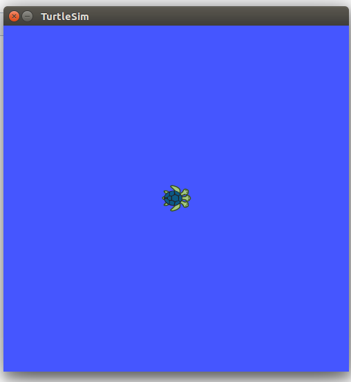
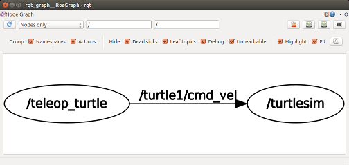
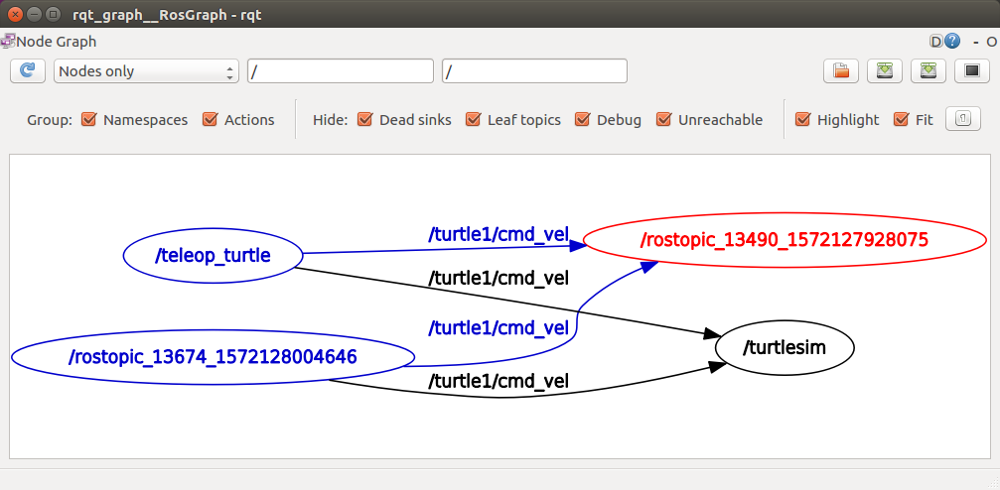
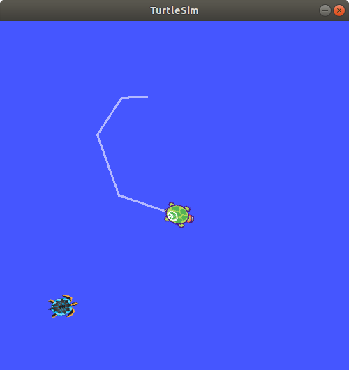
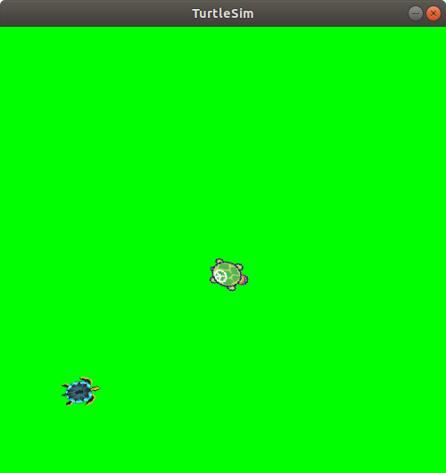

# ros_tutorials
Homework exercise 1.3 for Integration in Master in Robotics, UVic

# Tutorial 5
Here is the output of the turtlesim:



# Tutorial 6

Some sample screenshots I got doing tutorial 6:






# Tutorial 7
Calling services:
```rosservice call /spawn 2 2 0.2 "" ```


Changing parameters:
```
rosparam set /background_r 0
rosparam set /background_g 255
rosparam set /background_b 0
rosservice call /clear
```

