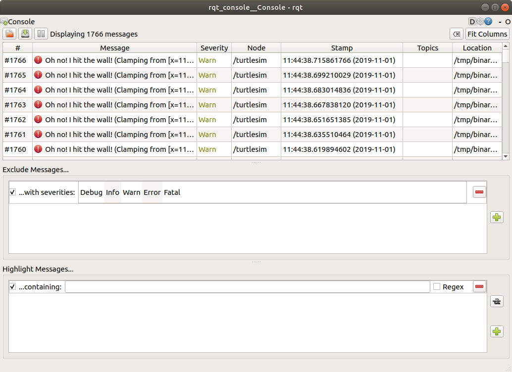
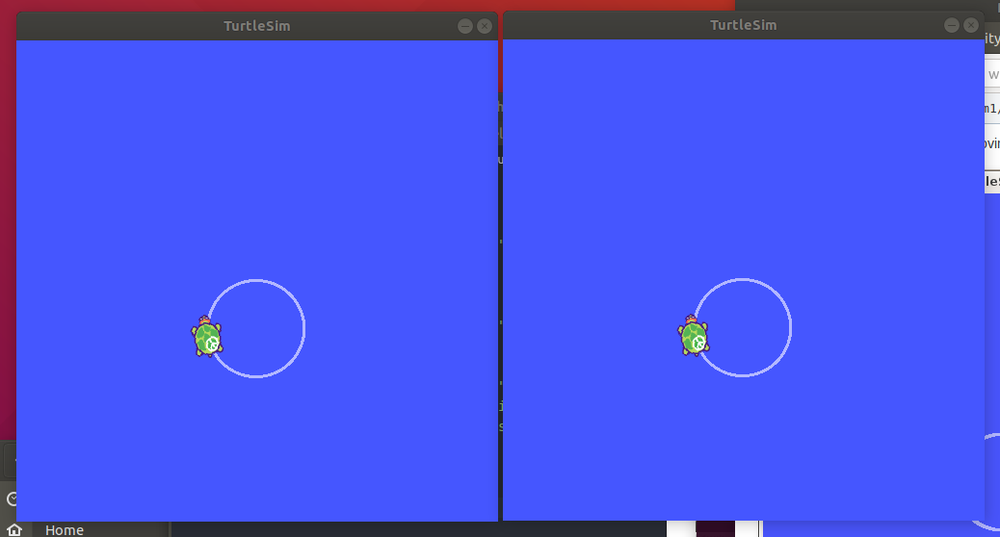
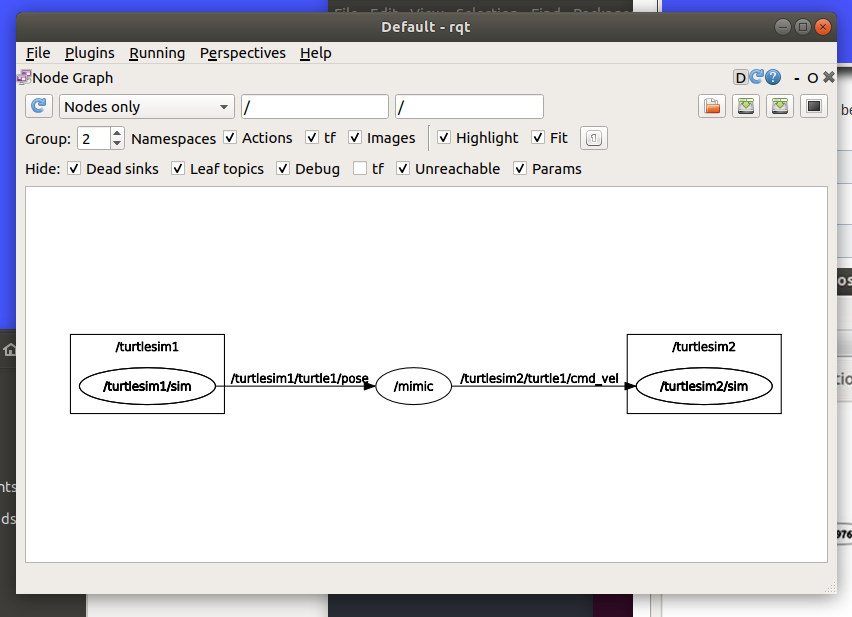

# ros_tutorials
Homework exercise 1.3 for Integration in Master in Robotics, UVic

# Tutorial 5
Here is the output of the turtlesim:


# Tutorial 6

Some sample screenshots I got doing tutorial 6:


# Tutorial 7
Calling services:
```rosservice call /spawn 2 2 0.2 "" ```


Changing parameters:
```
rosparam set /background_r 0
rosparam set /background_g 255
rosparam set /background_b 0
rosservice call /clear
```


# Tutorial 8
Setting the log level of the console:


Launching a roslaunch file:


Using rqt tools, rqt_graph in this case:


# Tutorial 9
Checking rosed to directly edit files faster.
I had to install vim with:
``` sudo apt install vim ```

Since vim is a bit difficult to understand all the keyboard commands, I changed my default to editor to nano, which I know better. This can be done adding the following line in your .bashrc user home directory:
``` export EDITOR='nano -w' ```

# Tutorial 11
After following the steps described in the tutorial, I run the nodes with these commands in separate shells:
```
rosrun begginer_tutorials talker
rosrun begginer_tutorials listener
```
And I can observe in the talker window:
```
...
[ INFO] [1572607668.634235135]: hello world 180
[ INFO] [1572607668.734235464]: hello world 181
[ INFO] [1572607668.834269658]: hello world 182
[ INFO] [1572607668.934264650]: hello world 183
...
```
And in the listener window:
```
...
[ INFO] [1572607668.634506434]: I heard: [hello world 180]
[ INFO] [1572607668.734737405]: I heard: [hello world 181]
[ INFO] [1572607668.834739739]: I heard: [hello world 182]
[ INFO] [1572607668.934757512]: I heard: [hello world 183]
....
```
# Tutorial 12
After downloading the python scripts, I launched with the following commands in different shells:
```
rosrun begginer_tutorials talker.py
rosrun begginer_tutorials listener.py
```
The output of the talker:
```
...
[INFO] [1572608592.058669]: hello world 1572608592.06
[INFO] [1572608592.158685]: hello world 1572608592.16
[INFO] [1572608592.258630]: hello world 1572608592.26
[INFO] [1572608592.358627]: hello world 1572608592.36
...
```
And here is the output of the listener:
```
...
[INFO] [1572608603.060363]: /listener_2839_1572608602423I heard hello world 1572608603.06
[INFO] [1572608603.160395]: /listener_2839_1572608602423I heard hello world 1572608603.16
[INFO] [1572608603.260302]: /listener_2839_1572608602423I heard hello world 1572608603.26
[INFO] [1572608603.360210]: /listener_2839_1572608602423I heard hello world 1572608603.36
...
```
